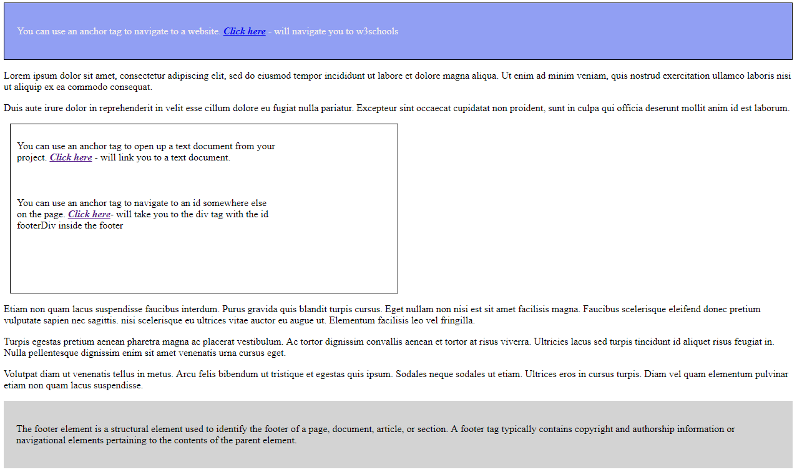

## Git Operations & Commands

### *Create Repositories*
  1. Create Central Repository on GitHub
  2. Create Local Repository
     * Install Git on your local machine
     * Create a folder on your local machine which will serve as the repo. Inside this folder, right click anywhere and select ‘Git Bash’ – this will open-up Git Emulator (Terminal).
     * New project (this will create a .git folder inside your local repository)--- **$ git init**	 
     * Joining an existing project --- **$ git clone** 
### *Sync Repositories*
  Add your central repository as your origin to your local repository ---**$ git remote add origin “[link]”**  
  (Click on the green “Clone or Download” button inside the central repository for the link.)
### *Fetch all files into your local*
  Updating your local repository --- **$ git pull origin master**
### *Making Changes*
  1. *Add to Index*
     * Adding a single file to your index:  --- **$ git add test_file.txt**
     * Adding multiple changes all at once: --- **$ git add -A**
  2. *Commit* - "snapshot of the repository"
     * Commit a single file --- **$ git commit -m "folder name changed"**
     * Commit multiple changes --- **$ git commit –a –m “adding 3 files”**
  3. *Lookup your commits/snapshots* 
     Git stores all commits --- **$ git log**

### *Branching*
  *Why branching* - Let’s say you want to add new features on to the main branch. You want to work on those new feature individually and you don’t want to interfere with the master branch - create a branch.
  Branches are pointers to a specific commit. There are two types of branches:
  - Remote-tracking branches – are branches that is  going to connect your local branches to your central repository.
  - Local branches – you create only in your workspace.
    * Lists all local branches in the current repository --- **$ git branch**
    * Creates a new branch        --- **$ git branch [branch-name]**
    * Switch/move around branches --- **$ git checkout [branch-name]**
### *Merging*
After you have create a new branch and developed a new feature in this branch, you need to merge to the project.
  - It is a way to combine the work of different branches together.
  - Allows to branch off, develop a new feature & combine it back in.
Now, merge the branches(folder) that you have created in the master branch. (Make sure you checkout in the destination branch(master))
    * Merge branches  ---  **$ git merge [branch]**
	* View the changes   ---  **$ cat [filename]**	
	
*Notes:*
- To view the changes in the terminal, make sure you are checkout in the same branch.
- You need to merge the branch to the master after any type modification/changes.
- After merging, you can ls the files when your are in the destination folder.
### *Git Push – ‘To Central Repository’*
  Once we have completed all changes we want to contribute the final draft to our central repository.
  * Push the changes to the central repository (from local master to central repo) ---**$ git push origin master**
  * Push the changes into different branch (not interfere with master branch). ---**$ git push origin firstbranch**
  
  Note: Make sure you checkout and work on the repository you just created (firstbranch).
  * Roll-back to previous version of a commit ---**$ git checkout [first 8 hexdig] [filename]**
  
  Note: First, check your log for the previous version *$ git log*, and copy the commit hash (the first 8 hexa digits).
  
## Exercise - Solutions for Git/Markdown Basics

### Markdown Basics

* headings # - ######
# This is header1 tag
## This is an header2 tag

* bold
**This text will be in bold**

* italics
*This text will be in italic*
_This text will also be in italic_

* links/images


[GitHub](http://github.com)

* lists (ordered/unorder)
* Item 1
  * Item 1A

Ordered List
1. Item 1
2. Item 2

task lists
- [x] this is a complete item
- [ ] this is an incomplete item

* code blocks
``` javascript
function(){
  console.log('hello world');
  }
```
* emojis
:+1:
* table
First Header | Second Header
------------ | -------------
Content cell1 | Content cell 2
Content column 1 | Content Column 2

## Exercise - HTML Basic Concepts & CSS Basic Concepts
* Make a web page.
* Add html, head, and body tags
* In the body add a header, article, section, footer
* In each of those add some divs, paragraphs, and spans of text.
* Apply classes and ids to html elements.
* add an anchor tag that links to your favorite website.
* wrap a div of text that links to your text document you created.
* use an anchor to link to an id somewhere else on the page.
* put a style tag in the head of your html and color an element using rgb, hex color, and a key word.
* set the height/width, padding, border, and margin for some of your elements.
* for an element that has a child:
    - put a px width/height on the parent.
    - on the child put a percentage width/height

## Solutions - HTML Basic Concepts & CSS Basic Concepts

``` html
<!DOCTYPE html>
<html lang="en">

<head>
    <meta charset="UTF-8">
    <meta name="viewport" content="width=device-width, initial-scale=1.0">
    <meta http-equiv="X-UA-Compatible" content="ie=edge">
    <title>Document</title>
    <!--style tag with rgb, hex color, and a key word color-->
    <style>
        header {
            background-color: rgb(145, 159, 243);
            color: #F5EEED;
            border: 1px solid black;
            padding: 20px;
        }
        /* height, width, padding, border, margin 
         * px width/height on the parent */
        div.main {
            height: 250px;
            width: 600px;
            padding: 10px;
            margin: 10px;
            border: 1px solid black;
        }
        /* percentage width/height on the child */
        div.main p {
            height: 30%;
            width: 70%;
        }
    </style>
</head>

<body>
    <!--header tag-->
    <header>
        <!--anchor tag will navigate to a webside-->
        <p>You can use an anchor tag to navigate to a website. <a
                href="https://www.w3schools.com/default.asp"><b><i>Click here</i></b></a> - will navigate you to
            w3schools</a></p>
    </header>
    <article>
        <p>Lorem ipsum dolor sit amet, consectetur adipiscing elit, sed do eiusmod tempor incididunt ut <span>labore et
                dolore magna aliqua. Ut enim ad minim veniam,</span> quis nostrud exercitation ullamco laboris nisi ut
            aliquip ex ea commodo consequat.</p>
        <p>Duis aute irure dolor in reprehenderit in <span> velit esse cillum dolore eu fugiat</span> nulla pariatur.
            Excepteur sint occaecat cupidatat non proident, sunt in culpa qui officia deserunt mollit anim id est
            laborum.</p>
    </article>
    <section>
        <div class="main">
            <!--anchor tag will navigate to a text document-->
            <p>You can use an anchor tag to open up a text document from your project. <a
                    href="/myTextDoc.txt"><b><i>Click
                            here</i></b></a> - will link you to a text document.</p>

            <!--anchor tag will navigate somewhere else on the page.-->
            <p>You can use an anchor tag to navigate to an id somewhere else on the page. <a
                    href="index.html#footerDiv"><b><i>Click here</i></b></a>- will take you to the div tag with the id
                footerDiv inside the footer</p>
        </div>
        <div id="content">
            <p>Etiam non quam lacus suspendisse faucibus interdum. Purus gravida quis blandit turpis cursus. Eget nullam
                non
                nisi est sit amet facilisis magna. Faucibus scelerisque eleifend donec pretium vulputate sapien nec
                sagittis. <span> nisi scelerisque eu ultrices vitae auctor eu augue ut.</span> Elementum facilisis leo
                vel
                fringilla.
                <p>Turpis egestas pretium aenean pharetra magna ac placerat vestibulum. Ac tortor dignissim convallis
                    aenean
                    et tortor at risus viverra. Ultricies lacus sed turpis tincidunt id aliquet risus feugiat in. Nulla
                    pellentesque dignissim enim sit amet venenatis urna cursus eget.</p>
                <p> Volutpat diam ut venenatis tellus in metus. Arcu felis bibendum ut tristique et egestas quis ipsum.
                    Sodales neque sodales ut etiam. Ultrices eros in cursus turpis. Diam vel quam elementum pulvinar
                    etiam
                    non quam lacus suspendisse.
        </div>
    </section>
    <footer style="background-color: lightgrey;padding:20px;">
        <div id="footerDiv">
            <p>The footer element is a structural element used to identify the footer of a page, document, article, or
                section. A footer tag typically contains copyright and authorship information or navigational elements
                pertaining to the contents of the parent element.</p>
        </div>
    </footer>
</body>

</html>

```


## Exercise - HTML/CSS Developer Basics

* add an html `aside` element and put it above your `section`
* float the `aside` to the side of the section
* use `inline-block` to make a 2 column layout (2 elements side by side)


## Solutions - HTML/CSS Developer Basics

``` html
    <aside>
        <p>Lorem ipsum dolor sit amet, consectetur adipiscing elit, sed do eiusmod tempor incididunt ut <span>labore
                et
                dolore magna aliqua. Ut enim ad minim veniam,</span> quis nostrud exercitation ullamco laboris nisi
            ut
            aliquip ex ea commodo consequat.</p>
        <p>Duis aute irure dolor in reprehenderit in <span> velit esse cillum dolore eu fugiat</span> nulla
            pariatur.
            Excepteur sint occaecat cupidatat non proident, sunt in culpa qui officia deserunt mollit anim id est
            laborum.</p>
    </aside>
```

```CSS
        section {
            border: 1px solid black;
            display: inline-block;
            width: 79%;
        }
        section div{
            padding: 10px;
        }
        aside {
            float: left;
            width: 19%;
            padding: 10px;
        }
```


## Exercise - CSS Typography, Backgrounds & Gradients

* set your paragraphs to be a web safe font.
* load a font from Google that you like and set that for your anchor tags.
* mess with font/text properties
* set your divs to a certain background color.
* load a background image to something
* set a background-gradient to something

## Solution - CSS Typography, Backgrounds & Gradients
```CSS
    <!--style tag with rgb, hex color, and a key word color-->
    <style>
        header {
            background-color: rgb(145, 159, 243);
            color: #F5EEED;
            border: 1px solid black;
            padding: 20px;
        }

        /* height, width, padding, border, margin 
         * px width/height on the parent */
        section {
            border: 1px solid black;
            display: inline-block;
            width: 79%;
        }

        /*setting divs to certain background color*/
        section div {
            padding: 10px;
            background-color: white;
        }

        /*adding a background image to aside*/
        aside {
            float: left;
            width: 19%;
            padding: 8px 10px;
            background-image: url(background_img.jpg)
        }

        /*messing around with font properties*/
        span {
            font-size: 12px;
            font-stretch: ultra-expanded;
            font-weight: bolder;
            font-variant: small-caps;
        }

        /* setting paragraphs to be a web safe font*/
        p {
            font-family: Arial, Helvetica, sans-serif;
        }

        /*setting background gradient*/
        footer {
            background-image: linear-gradient(white, rgb(172, 168, 168));
            padding: 20px;
        }
    </style>
    <!--Loading font from Google-->
    <link href="https://fonts.googleapis.com/css?family=Livvic&display=swap" rel="stylesheet">
```


## Exercise - HTML Lists, Form, Table

* add an unordered list of at least 3 items
* add an ordered list of at least 3 items
* create a table
* nest the unordered list in a cell
* nest the ordered list in another cell
* give the table a heading and footer 
* add an image tag
* give it a caption
* make a form with some different types of inputs

## Solution - HTML Lists, Form, Table

```HTML
        <div>
            <table id="list_tb" style="width:50%">
                    <caption>Menu-Table</caption>
                <thead>
                    <tr><th colspan="4" class="subject">Table with &lt;ul&gt; - &lt;ol&gt;</th></tr>
                    <tr>
                        <th colspan="2">An Unordered HTML List</th>
                        <th colspan="2">An Ordered HTML List</th>
                    </tr>
                </thead>
                <tbody>
                    <tr>
                        <td>
                            <ul>
                                <li>Coffee</li>
                                <li>Tea</li>
                                <li>Soda</li>
                            </ul>
                        </td>
                        <td></td>
                        <td>
                            <ol>
                                <li>Cookies</li>
                                <li>Cake</li>
                                <li>Muffins</li>
                            </ol>
                        </td>
                        <td></td>
                    </tr>
                </tbody>
                <tfoot>
                    <tr>
                        <td colspan="4">This is the footer-section</td>
                    </tr>
                </tfoot>
            </table>
        </div>
        <div>
            <!--Form-->
            <form name="myform" method="get" action="#">
                <table style="width: 20%;" cellpadding="5">
                    <tbody>
                        <tr>
                            <td>First Name: <input type="text" name="fname" maxlength="15"></td>
                            <td>Last Name: <input type="text" name="lname"></td>
                        </tr>
                        <tr>
                            <td>Email: <input type="email" name="myemail"></td>
                            <td>Phone: <input type="tel" name="myphone"></td>
                        </tr>
                        <tr>
                            <td>Radio button: <input type="radio" name="colors" id="myRadio" checked>
                                <input type="radio" name="colors" id="myRadio"></td>
                            <td><input type="checkbox" name="set1" value="1" checked> Chk One</br>
                                <input type="checkbox" name="set3" value="3" checked> Chk Two</br>
                                <input type="checkbox" name="set5" value="5"> Chk3 Three</td>
                        </tr>
                        <tr>
                            <td>Pick a book:<select name="book" id="bookslist">
                                    <option value="1">IT</option>
                                    <option value="2">Carrie</option>
                                    <option value="3">The Shining</option>
                                    <option value="4">Misery</option>
                                </select> </td>
                            <td>Pick a Date<input type="date" name="mydate" value="2019-08-24"></td>
                        </tr>
                    </tbody>
                </table>
                <p><input type="submit" value="Send"></p>
            </form>
        </div>

```
```CSS
table{
caption-side: bottom;
}
thead .subject{ text-align: center; font-size: 24px; font-weight: bolder;}
tbody {color:blue;}
tfoot {color:red; text-align: center;}
table#list_tb, table#list > td {
border: 1px solid black;
}
form{
border: black solid 1px;
}
```
