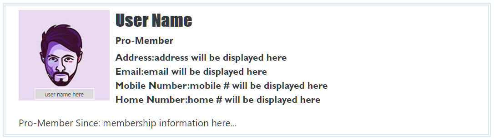
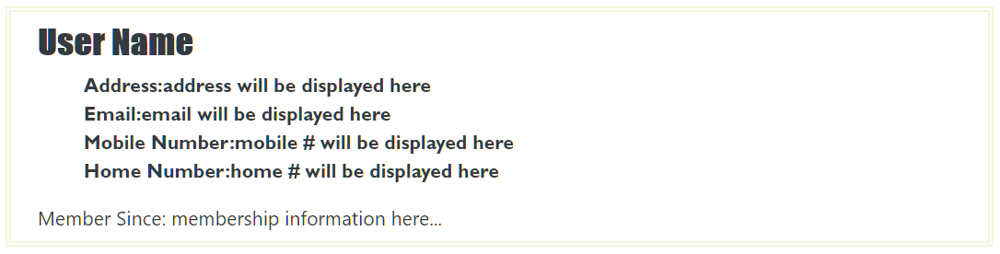
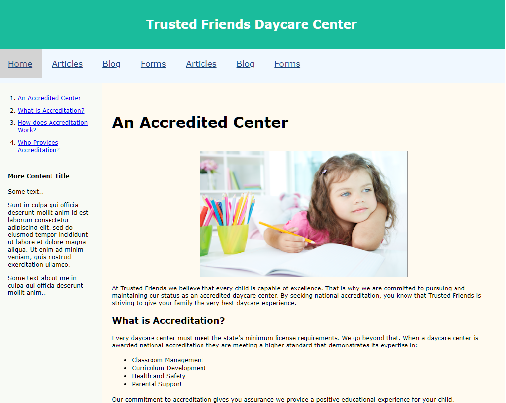
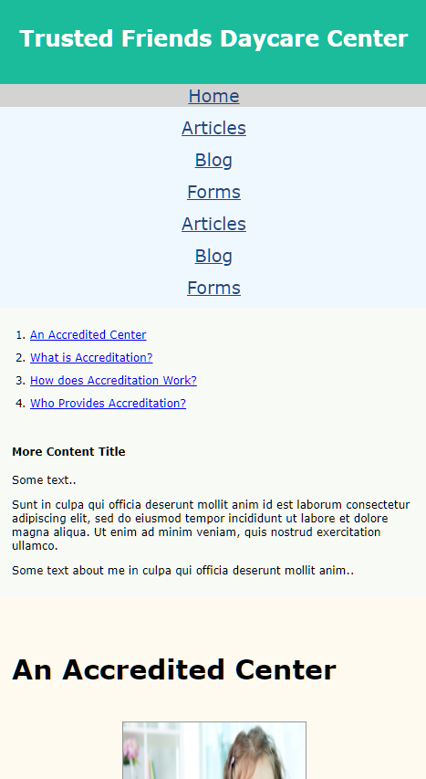
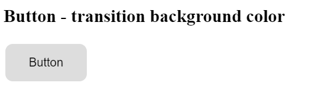
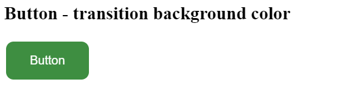
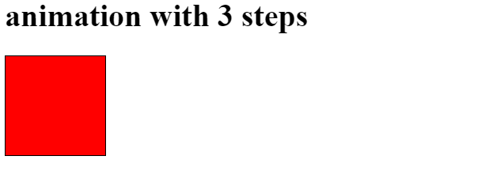
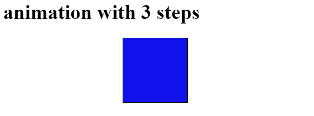

## Week 2 - Exercise - Solutions

* CSS Scaleability and Performance
* CSS Positioning II
* CSS Complex Selectors

### Exercise
1. give an element a block level class name
2. in that element give it a BEM class name
3. add offset to a parent with a child
4. position that child absolute and give it some offset
5. make a grand child of step 3
6. using z-index put the child of step 3 on top of the grand child

### Solutions

#### HTML Code:
``` html
    <section class="container">
        <!-- Block level element and BEM class names    -->
        <!-- Type of user will change the appearance of the profile -->
        <div class="profile profile--member-pro">
            <div class="profile__img">
                <div class="profile__avatar">
                    <figure>
                        
                    </figure>
                </div>
                <!-- offset is added for the name-display -->
                <!-- z-index is used for the box to be visible -->
                <div class="name_display"><span>user name here</span></div>
            </div>
            <h3 class="profile__username">User Name</h3>
            <h6>Pro-Member</h6>
              <div class="profile__contact">
                <ul>
                    <li>Address:<span>address will be displayed here</span></li>
                    <li>Email:<span>email will be displayed here</span></li>
                    <li class="profile_contact--cell">Mobile Number:<span>mobile # will be displayed here</span></li>
                    <li class="profile_contact--home">Home Number:<span>home # will be displayed here</span></li>
                </ul>
            </div>
         <div class="profile__membership-details">Pro-Member Since: <span>membership information here...</span>
            </div>
        <!-- Type of user will change the appearance of the profile -->
        </div>
        <div class="profile profile--member-new">
            <h3 class="profile__username">User Name</h3>
            <div class="profile__contact">
                <ul>
                    <li>Address:<span>address will be displayed here</span></li>
                    <li>Email:<span>email will be displayed here</span></li>
                    <li class="profile_contact--cell">Mobile Number:<span>mobile # will be displayed here</span></li>
                    <li class="profile_contact--home">Home Number:<span>home # will be displayed here</span></li>
                </ul>
            </div>
            <div class="profile__membership-details">Member Since: <span>membership information here...</span></div>
        </div>
    </section>


```

### CSS Code:

``` css
.profile{
    width:75%;
    padding-right:15px;
    padding-left:15px;
    margin: 10px 10px 35px 10px;
    outline-style:  double;
    outline-width: 5px; 
    outline-offset: 8px;  
}
@media (min-width: 576px){.container{max-width:540px}}
@media (min-width: 768px){.container{max-width:720px}}
@media (min-width: 992px){.container{max-width:960px}}
@media (min-width: 1200px){.container{max-width:1140px}}
.profile-fluid{width:100%;padding-right:15px;padding-left:15px;margin-right:auto;margin-left:auto}

.profile--member-pro{
    outline-color: rgba(28,110,164,0.15);
    position: absolute;
    display:  block;
}
.profile--member-new{
    outline-color: beige;
    display: none;
    position: absolute;
}
.profile__img{
    position: relative;
    float: left;
    margin-right: 10px;
}
.profile__avatar{ 
    float: left;
    width: 160px;
    height: 160px;
    display: absolute;
}
.name_display{
    border: 1px solid rgba(211, 127, 176, 0.15);
    background-color:gainsboro;
    outline: .5px solid white;
    outline-offset: 2px;
    z-index: 1;
    width: 100px;
    height: 15px;;
    bottom: 0px;
    margin: 0px 30px 4px 30px;
    position: absolute;
}
.name_display span{
    font-size: 10px;display:block;
    text-align: center;
    padding: 0px;
}

.profile__username{
    font-family: Impact, Haettenschweiler, 'Arial Narrow Bold', sans-serif;
}
.profile__contact{
    font-family: 'Gill Sans', 'Gill Sans MT', Calibri, 'Trebuchet MS', sans-serif;
    font-weight: bold;
    padding: 0px;
    margin: 0px;    
}
ul{
        list-style-type: none; 
}


```


#### Modify the CSS via JavaScript to change appearance of the user profile depending on his membership
``` css
.profile--member-pro{
    outline-color: rgba(28,110,164,0.15);
    position: relative;
}
.profile--member-new{
    outline-color: beige;
    display: block;
    position: relative;
}
```
#### Pro Member Profile 



#### New Member Profile




* CSS Responsive Web Design
* CSS Transforms


### Exercise
1. Use a media query to change the layout from 1 column on mobile to 2 columns on desktop
2. Set an image's height and width to use vw/vh
3. horizontally center an image in a parent
4. use hover to activate a transform


### Solutions

#### HTML Code:
``` html
<!DOCTYPE html>
<html lang="en">

<head>
    <meta charset="UTF-8">
    <meta name="viewport" content="width=device-width, initial-scale=1.0">
    <meta http-equiv="X-UA-Compatible" content="ie=edge">
    <link href="style.css" rel="stylesheet" />
    <title>Responsive Design with Media Queries</title>
</head>

<body>
    <!-- Header -->
    <header>
        <div class="header">
            <h1>Trusted Friends Daycare Center</h1>
        </div>
    </header>

    <!-- Navigation Bar -->
    <nav class="horizontal">
        <a href="index.html" id="currentPage">Home</a>
        <a href="#">Articles</a>
        <a href="#">Blog</a>
        <a href="#">Forms</a> <a href="#">Articles</a>
        <a href="#">Blog</a>
        <a href="#">Forms</a>
    </nav>

    <section class="row">
    <!-- The side left column -->
    <aside>
        <ol>
            <li><a href="#acc1">An Accredited Center</a></li>
            <li><a href="#acc2">What is Accreditation?</a></li>
            <li><a href="#acc3">How does Accreditation Work?</>
            </li>
            <li><a href="#acc4">Who Provides Accreditation?</a></li>
        </ol>
        <article>
            <h4>More Content Title</h4>
            <p>Some text..</p>
            <p>Sunt in culpa qui officia deserunt mollit anim id est laborum consectetur adipiscing elit, sed do eiusmod
                tempor incididunt ut labore et dolore magna aliqua. Ut enim ad minim veniam, quis nostrud exercitation
                ullamco.</p>

            <p>Some text about me in culpa qui officia deserunt mollit anim..</p>
        </article>
    </aside>
    <!-- The main right column -->
    <section class="main">
            <article>
                <h1 id="acc1">An Accredited Center</h1>
                
                <p> At Trusted Friends we believe that every child is capable of excellence.
                    That is why we are committed to pursuing and maintaining our status as an accredited daycare center. By seeking national accreditation, you know
                    that Trusted Friends is striving to give your family the very best daycare experience.</p>
                <h2 id="acc2">What is Accreditation?</h2>
                <p>Every daycare center must meet the state's minimum license requirements. We go beyond that. When a daycare center is awarded national accreditation they are meeting a higher standard that demonstrates its expertise in:</p>
                <ul>
                    <li>Classroom Management</li>
                    <li>Curriculum Development</li>
                    <li>Health and Safety</li>
                    <li>Parental Support</li>
                </ul>
                <p>Our commitment to accreditation gives you assurance we provide a positive
                    educational experience for your child.</p>
                <h2 id="acc3">How does Accreditation Work?</h2>
                <p>Every other year we go through an intense review by recognized and esteemed national accreditation
                    agencies. Their positive reports (available for inspection) confirm that we are providing a clean,
                    safe, and positive
                    environment for our children. Accreditation verifies that our teachers are qualified and fully
                    engaged in giving our children a first-class educational
                    experience.</p>
    
                <h2 id="acc4">Who Provides Accreditation?</h2>
                <p>There are several national organizations that provide accreditation services.
                    Who a center chooses for oversight is important. Trusted Friends pursues national
                    accreditation from three of the most
                    respected national early childhood accreditation agencies:</p>
                <ul>
                    <li><a href="http://www.example.com/nayc">National Association for Youth Care</a></li>
                    <li><a href="http://www.example.com/uaece">United Accreditation for Early Care and Education</a></li>
                    <li><a href="http://www.example.com/nda">National Daycare Accreditation</a></li>
                </ul>
                <p>Feel free to contact us to discuss accreditation and learn more about our standards for care and
                    education.</p>
            </article>
        </section>
    </section>
    <footer>
        Trusted Friends &#8226; 3450 Regency Lane, Carmel IN
    </footer>
</body>
</html>

```

### CSS Code:

``` css

/* HTML and Body Styles */  

html {
    height: 100%;
    font-family: Verdana, Geneva, sans-serif;
    font-size: 12px;
 }
 
 body {
    width: 100%;
    max-width: 1024px;
    margin: 0px auto;
 }

 /* Body Header Styles */

body > header {
   color: white;
   padding: 20px;
   text-align:center;
   background: #1abc9c;
 }
 

/* Horizonal Navigation Styles */

nav.horizontal {   
   background-color: aliceblue;
   display: flex;
 }

 nav.horizontal a{     
     color: rgb(31, 73, 125);
     font-size: 1.4em;
     line-height: 2em;
     padding: 13px 20px;
     margin-bottom: 10px;     
 }
 
 nav.horizontal a#currentPage {
    text-decoration: underline;
    background-color: lightgrey;
 }
 nav.horizontal a#currentPage:hover {
    text-decoration: underline;
    background-color: rgb(31, 73, 125);
    color: rgb(231, 231, 231);
 }

 /* hover over the a tag will change the background color property*/
 nav.horizontal a:hover {
    background-color: rgb(31, 73, 125);
    color: rgb(231, 231, 231);
 }


/* Column container*/
.row{
   display: flex;
   flex-wrap: wrap;
}
/* Aside Column */

.row aside {
    background-color: rgb(248, 250, 245);
    flex:20%;
    z-index: -1;
 } 
.row aside > ol > li {
      padding-top: 10px;
 } 
.row aside > article{
    padding: 10px 20px;
 }


/* Section Main Column */

.main {
    background-color: floralwhite;
    padding: 20px;
    flex: 75%;
    z-index: -1;
 }
 
.main h1 {
    font-size: 2.5em;
    line-height: 1.2;
 }
 
.main ul {
    list-style-type: disc;
    line-height: 1.4;
    padding-left: 40px;
 } 
 
.main > article > h2 {
    font-size: 1.5em;
    line-height: 1.4;
 }
 
.main > article > p {
    margin: 15px 0px;
 }
 /* 2. Set an image's height and width to use vw/vh */
 /* 3. horizontally center an image in a parent */
.main > article img {
    border: 1px solid rgb(151, 151, 151);
    display: block;
    margin: 10px auto;
    width: 40vw;
    height: 30vh;
 }

footer {
    background-color: rgb(117, 140, 72);
    font-size: 0.9em;
    text-align: center;
    padding: 10px 0px;
    flex:100%;
 }

 /* Use of media query to change the layout from 1 column on mobile to 2 columns on desktop */

/* =========================
   Mobile Styles: 0 to 480px 
   =========================
*/

@media only screen and (max-width: 480px) {
   nav.horizontal {
      flex-direction: column;
      text-align: center;  
   }
   nav.horizontal a{     
      color: rgb(31, 73, 125);
      font-size: 1.6em;
      line-height: 1em;
      padding: 3px 10px;      
  }
}

/* ============================================
   Tablet and Desktop Styles: 481px and greater 
   ============================================
*/

@media only screen and (max-width: 700px) {

   nav.horizontal {
      flex-direction: column;
      text-align: center;
  
   }
   nav.horizontal a{     
      color: rgb(31, 73, 125);
      font-size: 1.6em;
      line-height: 1em;
      padding: 3px 10px;      
  }
}
```

#### Desktop View 



#### Mobile View




* CSS Transitions & Animations
* HTML/CSS Polyfills
* HTML SEO
* HTML Accessibility

### Exercise

1. add the HTML5 Shiv to your project
2. add some Aria roles to some of your elements
3. transition a button's background-color when you hover
4. create an animation with at least 3 steps

### Solutions

1. add the HTML5 Shiv to your project

To *manually install* HTML5 Shiv - got to:
[GitHub](https://github.com/aFarkas/html5shiv)
Download the zip package and copy these files to your project:
* dist/html5shiv.js
* dist/html5shiv-printshiv.js
Include one of them into your <head> section.

#### HTML Code:
``` html
<!DOCTYPE html>
<html lang="en">

<head>
    <meta charset="UTF-8">
    <meta name="viewport" content="width=device-width, initial-scale=1.0">
    <meta http-equiv="X-UA-Compatible" content="ie=edge">
    <!--[if lt IE 9]>
        <script src="/js/html5shiv.js"></script>
    <![endif]-->
    <title>Document</title>
</head>

<body>

</body>

</html>


```


2. add some Aria roles to some of your elements


#### HTML Code:
``` html
<body>
    <header role="banner">ARIA roles are added to HTML markup like an attribute. They define the type of element and suggest what purpose it serves. The following example identifies the element as some kind of banner
    </header>
    <!-- role presentation is used when an element is simply for presentation. The screen reader will not read out this tag. -->
    <a href="aria.html" role="presentation">
        
    </a>
</body>

```

3. transition a button's background-color when you hover


#### HTML Code:
``` html
<h2>Button - transition background color</h2>

<button class="btn">Button</button>

```

### CSS Code:

``` css
.btn {
  background-color: #ddd;
  border: none;
  color: black;
  padding: 16px 32px;
  text-align: center;
  font-size: 16px;
  margin: 4px 2px;
  transition: 0.3s;
  border-radius: 10px;
}

.btn:hover {
  background-color: #3e8e41;
  color: white;
}

```

#### Button original



#### Button with transition hover effect 



4. create an animation with at least 3 steps


#### HTML Code:
``` html

<body>
 <!-- box will change color; move to the right; and iterrate the same process twice -->
<h1>animation with 3 steps</h1>
<div></div>
</body>

```


### CSS Code:

``` css
div {
  width: 100px;
  height: 100px;
  background: red;
  position: relative;
  animation-duration: 3s;	
  animation-name: mymove, colorchange;
  animation-iteration-count: 2;
}
@keyframes mymove {
  from {left: 0px;}
  to {left: 200px;}
}

@keyframes colorchange {
  0% { background: yellow }
  100% { background: blue }
}

div {
  width: 100px;
  height: 100px;
  border: 1px solid black;
}

```

#### Hover over the box to animate it



#### Box moves and changes color 2 times.


