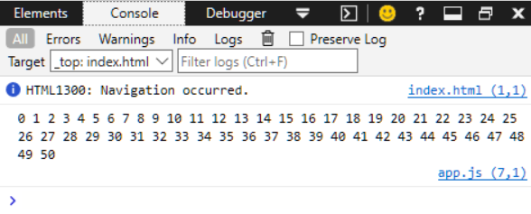

## Week 3 - Exercise/Solutions - JavaScript

* in the browser add 2 strings together and return the answer

```JavaScript
let string1 = 'Hi there';
let string2 = 'See ya later.';

let result = string1 + ' ' +string2;
console.log(result);

Hi there See ya later.
```
---

* create an html file 
    - internally, create a variable that stores a string 
        - add a string to your variable (`+`)
    - log the answer to the console
    - load it into the browser to check the answer

```html
<body>
    <script>
        let name = 'Tom';
        name += ' Smith';
        console.log(name);
    </script>    
</body>
```


---

* link to an external javascript file
    - create a variable that stores a string
    - create a variable that stores an integer
    - multiply those two variables together (`*`)
    - log the answer to the console
    - load the browser to check the answer

```html
    <!--link to an external javascript file-->
    <script type="text/javascript" src="app.js"></script>
```
```javascript
let number1 = '5';
let number2 =  2;

let result1 = number1 * number2;
let result2 = parseInt(number1) * number2;
console.log("result1 ="+ result1 + "\n" + "result2 =" + result2);
```


---

* **bonus** in your external javascript file
    - add \'2 + true\' and see what you get
```javascript
let number1 = '5';
let number2 =  2;

let result1 = number1 * number2 + '2 + true';
let result2 = parseInt(number1) * number2 + parseInt(2 + true);
console.log("result1 ="+ result1 + "\n" + "result2 =" + result2);
```


---

* create a counter variable with the value of 2
    - add 5 to it
    - then multiply that result by 2
    - log the output. Did you get 14?
    - modulo that answer by 3. Before you log the answer write a comment what you think it is going to return.
    - What happens when you modulo that answer by 2? Write in a comment if it returned what you expected?
```javascript
let counter = 2;
counter += 5;
counter *=2;

console.log('The result of this operation should be 2 \n 3*3*3=12 remainder of 14 and 12 is 2.');
console.log(counter % 3);
```


---

* create an `if` statement that tests if your variable modulus 2 returns 0
* create an `else` statement that logs that the variable was not even
    - log in the console the answer
```javascript
let counter = 6;
result = counter % 2;
if(result === 0){
    console.log('The result of variable counter modulus 2 is equal to 0');
}else{
    console.log('The result for this operation is not 0; Result = '+ result);
}
```


---

* create a conditional statement that tests the state of your variable in 4 different ways
    - in each of them link 2 comparisons together using logical operators
```javascript
let counter = 14;
result = counter % 5;
if(result !== 0 && result < 3 || result * result > 10 && result * result < 20){
    console.log('Acceptable outcome. \nThe result is ' + result);
}else{
    console.log('The outcome is '+ result);
}
```


---

* create 3 `if` statements back to back. Comment the difference between multiple `if` statements and 1 conditional statement.
```javascript
result =9;

if(isNaN(result))
console.log('This block will be executed. \n The result is not a number. \nResult is ' + result);
if(result === null)
console.log('This block will be executed. \nResult is null');
if(typeof(result)=== 'number' && result < 10)
console.log('This block will be executed. \nResult is a type of integer and is smaller than 10');
```


---

* create a counter variable
* add 1 and log it 50 times using a for loop
```javascript
let number =0;
let counter = 0;

for(counter; counter<=50; counter++){
    number = number + counter + ' ' ;  
}
console.log(number);
```


---

* make a while loop that logs every other number up until 50
```javascript
let number =0;
let counter = 0;

while(counter <= 50){
    number = number + counter + ' ';
    counter +=2;
}
console.log(number);
```


---

* loop from 0 to 100
    - log the string `fizz` if the number is divisible by 3
    - log the string `buzz` if the number is divisible by 5
    - log the string `fizzbuzz` if the number is divisibly by both
```javascript
for(let counter = 0; counter <= 50; counter++){
    if(counter %3 === 0 && counter %5 === 0){
        console.log('fizzbuzz - the number is ' + counter);
    }
    else if(counter %3 ===0){
        console.log('fizz - the number is ' + counter);
    }
    else if(counter %5 === 0){
        console.log('buzz - the number is ' + counter);
    }
}
```


---

* create a function that takes two arguments and adds them together
```javascript
// named function
function addingUp_Args(argument1, argument2){
    return argument1 + argument2;
}
console.log(addingUp_Args('Hi there ','I\'m back!'));

// anonymous function
var myFunction = function(arg1,arg2){
    return arg1 + arg2;
}
console.log(myFunction('Here we have \n','an anonymous function.'));

// IIFE function
var arg1 = 'This function will used only once.';
var arg2 = '\nIt\'s called an Immediately Invokable Function Expression.';
(function(arg1,arg2) {
    console.log(this.arg1 + this.arg2);
})();

// arrow function
var myArrowFunction = (arg1,arg2) => {console.log(arg1+arg2)};
myArrowFunction('Arrow functions:','\nare syntatically alternatives to regular functions');

var argA = 'This arrow function is IIFE';
var argB = '\nand will used only once';
// this arrow function is IIFE 
(() => console.log(this.argA+this.argB))();
```


---

* create a function that takes two arguments and multiplies them together
```javascript
// named function
function multiply(argument1, argument2){
    return argument1 * argument2;
}
console.log(multiply(5,12));
```


---

* create a function that takes two arguments where the first argument is the start number and the second argument is the end number. The body of the function starts a loop and ends it at the second argument and logs every number between the start and end number.
```javascript
function multiply(argument1, argument2){
    for(var x = argument1; x <= argument2; x++){
        console.log(x);
    }
}
```


---

* create a variable in the global scope
    - create a function that takes an argument
    - add the argument to the global variable
    - log the return of that function

```javascript
var name;
function getName(argument){
    this.name = argument;
}
getName(prompt('what is your name'));
console.log("Hello " + name);
```


---

* create an IIFE that logs your success of creating an IIFE
```javascript
// IIFE function
var arg1 = 'This function will be used only once.';
var arg2 = '\nIt\'s called an Immediately Invokable Function Expression.';
(function(arg1,arg2) {
    console.log(this.arg1 + this.arg2);
})();
```


---

* create a function that takes user input and compares it against a random number. If there is a match then log the success.
```javascript
let index = 1;
function compareNum(){    
    do{
        var num = parseInt(prompt('Guess a random number between 1-3'));
        var rndNum;
        var selected = false;
        do{
            rndNum = Math.floor(Math.random()*10);
        }while(rndNum < 1 || rndNum > 3 )
        
        console.log(index+'. attempt - Selected number was: '+rndNum );
        index++;
        if(rndNum === num){
            console.log('Great guess!');
            selected =  true;
        }else{1
            console.log('Sorry guess again!');
        }
    }while(!selected)
}
compareNum();1
```


---

* make an array of 10 grocery store items loop through that array and log each item.
```javascript
let items = ['water','soda','detergent','apple','banana','tomatos','bread','butter','milk','chicken'];
function shoppingCart(){    
    items.forEach(element => {
        console.log(element.toUpperCase());
    });
}
shoppingCart();
```


---

* loop through a string at least 10 characters long and log each character
```javascript
let items = 'comparison';
function stringLoop(){    
    for(var i = 0; i < items.length; i++){
        console.log(items.charAt(i));
    }
}
stringLoop();
```


---

* make that string upper case
```javascript
let items = 'comparison';
function stringLoop(){    
    for(var i = 0; i < items.length; i++){
        console.log(items.charAt(i).toUpperCase());
    }
}
stringLoop();
```


---

* Create an inventory array and associate a number with each item. Then get user input that purchases items (subtracts one from the item).
*** HTML Code
```html
<body>
    <h2>Dynamic Inverntory display in Modal Box</h2>
    <!-- Trigger/Open The Modal -->
    <button id="myBtn">Open Modal</button>

    <!-- The Modal -->
    <div id="myModal" class="modal">

        <!-- Modal content -->
        <div class="modal-content">
            <span class="close">&times;</span>
            <form>
                <fieldset>
                    <h4>Pick an item to add it to your cart:</h4>
                    <ul>
                        <table id="inventoryTable">
                            <tr>
                                <th id="product">Product</th>
                                <th></th>
                                <th>Quantity in Stock</th>
                            </tr>
                            <!--This is where we insert the data dynamically-->
                        </table>
                    </ul>
                </fieldset>
            </form>
        </div>
    </div>
    <!--link to an external javascript file-->
    <script type="text/javascript" src="app.js"></script>
</body>
```
*** CSS Code
```CSS
body {font-family: Arial, Helvetica, sans-serif;}

/* The Modal (background) */
.modal {
  display: none; /* Hidden by default */
  position: fixed; /* Stay in place */
  z-index: 1; /* Sit on top */
  padding-top: 100px; /* Location of the box */
  left: 0;
  top: 0;
  width: 100%; /* Full width */
  height: 100%; /* Full height */
  overflow: auto; /* Enable scroll if needed */
  background-color: rgb(0,0,0); /* Fallback color */
  background-color: rgba(0,0,0,0.4); /* Black w/ opacity */
}

/* Modal Content */
.modal-content {
  background-color: #fefefe;
  margin: auto;
  padding: 20px;
  border: 1px solid #888;
  width: 60%;
}
.modal-content h4{
    padding-left: 40px;
}
.modal-content fieldset{
border:none;}
.modal-content ul{
 list-style:none;
}.modal-content ul li{
padding-left:10px;}

table.inventoryTable{
  border: 1px solid black;
}
input{
    align-content: left;
}
td{text-align: center;}

td.items{
    text-align: left;
}

/* The Close Button */
.close {
  color: #aaaaaa;
  float: right;
  font-size: 28px;
  font-weight: bold;
}

.close:hover,
.close:focus {
  color: #000;
  text-decoration: none;
  cursor: pointer;
}
```
*** JavaScript Code
```javascript
// Declare Global Properties
var value;
var tr;
var td;
var li;
var input;
var td2;
var td3;
var val;
var inventory = [];

// Get the modal
var modal = document.getElementById("myModal");

// Get the button that opens the modal
var btn = document.getElementById("myBtn");

// Get the <span> element that closes the modal
var span = document.getElementsByClassName("close")[0];

// Stores the Selected item
let selectedItem = "";


// Initialize the elements
function fillArray() {
    inventory["water"] = 100,
        inventory["soda"] = 100,
        inventory["detergent"] = 50,
        inventory["apple"] = 100,
        inventory["banana"] = 100,
        inventory["tomato"] = 100,
        inventory["bread"] = 50,
        inventory["butter"] = 50,
        inventory["milk"] = 50,
        inventory["chicken"] = 50;
}
window.addEventListener('load', fillArray());

// Dynamically create the inventory list inside the Modal Box.
function createInventoryList() {
    let table = document.getElementById('inventoryTable');
    for (var key in inventory) {
        value = inventory[key];
        tr = document.createElement('tr');
        td = document.createElement('td');
        li = document.createElement('li');
        input = document.createElement('input');
        input.type = 'radio';
        input.name = 'items';
        input.value = key;
        input.addEventListener('input', setItem);
        td2 = document.createElement('td');
        td2.innerText = key;
        td2.classList = "items";
        td3 = document.createElement('td');
        td3.innerText = value + " qty";
        li.appendChild(input);
        td.appendChild(li);
        tr.appendChild(td)
        tr.appendChild(td2);
        tr.appendChild(td3);
        table.appendChild(tr);
    }
}
// Method call
createInventoryList();

// Set the selected item property
function setItem(e) {
    selectedItem = e.target.value;
}

// Calculate the quantity left in stock; update global property and return statement
function modifyItemQuantity(item) {
    if (inventory[item] !== 0) {
        val = inventory[item] - 1;
        return item + "- Quantity left in stock: " + val; //inventory[item];
    } else {
        return item + " is out off stock.";
    }
}

// When the user clicks the button, open the modal if the value of an element in the array is modified display it.
btn.onclick = function () {
    modal.style.display = "block";
    var row = document.querySelectorAll('input');
    row.forEach(element => {
        if (element.value === selectedItem) {
            var newRow = element.parentElement.parentElement.parentElement;
            newRow.lastChild.innerText = inventory[selectedItem] + ' qty';
        }
    });
}

// Update the array
function updateArray(modifiedItem) {
    switch (modifiedItem) {
        case 'water':
            inventory['water'] = val;
            break;
        case 'soda':
            inventory['soda'] = val;
            break;
        case 'detergent':
            inventory["detergent"] = val;
            break;
        case 'apple':
            inventory["apple"] = val;
            break;
        case 'banana':
            inventory["banana"] = val;
            break;
        case 'tomatos':
            inventory["tomatos"] = val;
            break;
        case 'bread':
            inventory["bread"] = val;
            break;
        case 'butter':
            inventory["butter"] = val;
            break;
        case 'milk':
            inventory["milk"] = val;
            break;
        case 'chicken':
            inventory["chicken"] = val;
            break;
        default:
            break;
    }
}
// When the user clicks on <span> (x), close the modal 
span.onclick = function () {
    modal.style.display = "none";
    alert(modifyItemQuantity(selectedItem));
    updateArray(selectedItem);
}

// When the user clicks anywhere outside of the modal, close it
window.onclick = function (event) {
    if (event.target == modal) {
        modal.style.display = "none";
        alert(modifyItemQuantity(selectedItem));
        updateArray(selectedItem);
    }
}
```
#### Screen-shot 1


#### Screen-shot 2

#### Screen-shot 3

#### Screen-shot 4

#### Screen-shot 5


---

* Grocery Store app
    - functions:
        - add to inventory
        - subtract from inventory
        - Notify when out of stock
    - data:
        - inventory
        - inventory count
*** HTML Code
```html
<body>
    <h2>Dynamic Inverntory display with add/delete/count and alert box functionality</h2>
    <!-- Trigger/Open The Modal -->
    <button id="myBtn">Open Modal</button>
    <h3>Add Inventory</h3>
    <div class="flex-container">
        <form id="addInventory">
            <div>
                <label for="inventoryName">Inventory Name: </label>
                <input id="inventoryName" type="text" placeholder="Product Name">
            </div>
            <div>
                <label for="quantity">Quantity:
                </label><input id="quantity" type="number">
            </div>
            <div>
                <input type="button" id="addProduct" value="Add Product">
            </div>
            <div>
                <table id="productList"></table>
            </div>
        </form>
    </div>

    <!-- The Modal -->
    <div id="myModal" class="modal">
        <!-- Modal content -->
        <div class="modal-content">
            <span class="close">&times;</span>
            <form>
                <fieldset>
                    <h4>Pick an item to add it to your cart:</h4>
                    <ul>
                        <table id="inventoryTable"></table>
                    </ul>
                </fieldset>
            </form>
        </div>
    </div>
    <!--link to an external javascript file-->
    <script type="text/javascript" src="app.js"></script>
</body>

```

*** CSS Code
``` CSS
body {font-family: Arial, Helvetica, sans-serif;}

/* The Modal (background) */
.modal {
  display: none; /* Hidden by default */
  position: fixed; /* Stay in place */
  z-index: 1; /* Sit on top */
  padding-top: 100px; /* Location of the box */
  left: 0;
  top: 0;
  width: 100%; /* Full width */
  height: 100%; /* Full height */
  overflow: auto; /* Enable scroll if needed */
  background-color: rgb(0,0,0); /* Fallback color */
  background-color: rgba(0,0,0,0.4); /* Black w/ opacity */
}

/* Modal Content */
.modal-content {
  background-color: #fefefe;
  margin: auto;
  padding: 20px;
  border: 1px solid #888;
  width: 60%;
}
.modal-content h4{
    padding-left: 40px;
}
.modal-content fieldset{
border:none;}
.modal-content ul{
 list-style:none;
}.modal-content ul li{
padding-left:10px;}

table.inventoryTable{
  border: 1px solid black;
}
td{text-align: center;}

td.items{
    text-align: left;
}


/* The Close Button */
.close {
  color: #aaaaaa;
  float: right;
  font-size: 28px;
  font-weight: bold;
}

.close:hover,
.close:focus {
  color: #000;
  text-decoration: none;
  cursor: pointer;
}

/* Flex-Box style*/
.flex-container {
  display: flex;
  background-color: #b1b1b1;
  width: auto;
}

.flex-container  div {
  background-color: white;
  margin: 10px;
  padding: 30px;
  font-size: 20px;
  flex:1;
}
.flex-container input{
  text-align: right;
}
.flex-container input#quantity{
  float: right;
}

```
*** JavaScript Code
``` javascript

// Declare Global Properties
var value;
var tr;
var td;
var li;
var input;
var td2;
var td3;
var val;
var inventory = [];

// Get the modal
var modal = document.getElementById("myModal");

// Get the button that opens the modal
var btn = document.getElementById("myBtn");

// Get the <span> element that closes the modal
var span = document.getElementsByClassName("close")[0];

// Stores the Selected item
let selectedItem = "";

// Initialize the elements
function fillArray() {
    inventory["water"] = 100,
        inventory["soda"] = 100,
        inventory["detergent"] = 50,
        inventory["apple"] = 100,
        inventory["banana"] = 100,
        inventory["tomato"] = 100,
        inventory["bread"] = 50,
        inventory["butter"] = 50,
        inventory["milk"] = 50,
        inventory["chicken"] = 50;
}

// Event Listeners
window.addEventListener('load', fillArray(),  productList());

// Add event listener to the Add Product Button
document.getElementById('addProduct').addEventListener('click', addProduct);

// Add a new product to the iventory array:
function addProduct() {
    // get the values
    var product = document.getElementById('inventoryName').value;
    var quantity = document.getElementById('quantity').value;
    // add to inventory if not empty
    if (product !== "" && quantity !== "") {
        inventory[product] = parseInt(quantity);
        alert("Saved "+ product + " of "+ quantity + " units.");
        // add to the UI
        productList();
    } else {
        alert('*Cannot add the product*');
    }
    document.getElementById('inventoryName').value = "";
    document.getElementById('quantity').value = "";
}

// Clear the table content
function clearTable(table) {
    // Get the Product Table
    var tr = table.getElementsByTagName("tr");
    // Remove the elements
    if(tr.length !== 0){
        while (table.childNodes[1]) {
            table.removeChild(table.childNodes[1]);
        }
    }
}

// Dynamically create the first tr element for heading
function createFirstTrTag(table){
    var tr = document.createElement('tr');
    var tbody = document.createElement('tbody');  
    var th1 = document.createElement('th');
    th1.innerText = "Product";
    var th2 = document.createElement('th');
    var th3 = document.createElement('th');
    th3.innerHTML = 'Quantity in Stock';
    tr.appendChild(th1);
    tr.appendChild(th2);
    tr.appendChild(th3);
    tbody.append(tr);
    table.append(tbody);
}

// Dynamically Display the Product Table
function productList() {
    var table = document.querySelector('#productList');
    createFirstTrTag(table)
    // clear the table content before adding new rows
    clearTable(table);
    // iterate through the inventory and display each product
    for (var key in inventory) {
        var tr = document.createElement('tr');
        var td1 = document.createElement('td');
        td1.innerText = key;
        var td2 = document.createElement('td');
        td2.innerText = " - ";
        var td3 = document.createElement('td');
        td3.innerText = inventory[key];
        tr.appendChild(td1);
        tr.appendChild(td2);
        tr.appendChild(td3);
        table.appendChild(tr);
    }
}

// Clear the table before displaying it.
function clearModelTable(table) {
    console.log(table);
    var tr = table.getElementsByTagName('tr');
    console.log(tr);
    if(tr.length !== 0){
        while(table.childNodes[1]){
            table.removeChild(table.childNodes[1]);
        }
    }
}

// Dynamically create the inventory list inside the Modal Box.
function createInventoryList() {
    var table = document.querySelector('#inventoryTable');     
    createFirstTrTag(table);
    // clear the modal table content before adding new rows   
    clearModelTable(table);
    // iterate through the inventory and display each product
    for (var key in inventory) {
        var tr = document.createElement('tr');
        var td = document.createElement('td');
        var li = document.createElement('li');
        var input = document.createElement('input');
        input.type = 'radio';
        input.name = 'items';
        input.value = key;
        input.addEventListener('input', setItem);
        var td2 = document.createElement('td');
        td2.innerText = key;
        td2.classList = "items";
        var td3 = document.createElement('td');
        td3.innerText = inventory[key] + " qty";
        li.appendChild(input);
        td.appendChild(li);
        tr.appendChild(td)
        tr.appendChild(td2);
        tr.appendChild(td3);
        table.appendChild(tr);
    }
}

// Calculate the quantity left in stock; update global property and return statement
function modifyItemQuantity(item) {
    if (inventory[item] !== 0) {
        if(selectedItem === ""){
            return "Nothing was selected";
        }else{
                    val = inventory[item] - 1;
        return item + "- Quantity left in stock: " + val;
        }
    } else {
        return item + " is out off stock.";
    }
}

// Set the selected item property
function setItem(e) {
    selectedItem = e.target.value;
}

// Open the modal when clicked.
btn.onclick = function () {
    // clear the radio button selection
    selectedItem = "";
    // display the modal
    modal.style.display = "block";
    // call the function to display the inventory
    createInventoryList();
}

// When the user clicks on <span> (x), close the modal 
span.onclick = function () {
    modal.style.display = "none";
    // display alert box when closing
    alert(modifyItemQuantity(selectedItem));
    //change the value of the selected item in the inventory
    if(selectedItem !== ""){
    inventory[selectedItem] = val;
    productList();
    }
}

// When the user clicks anywhere outside of the modal, close it
window.onclick = function (event) {
    if (event.target == modal) {
        modal.style.display = "none";
        // display alert box when closing
        alert(modifyItemQuantity(selectedItem));
        //change the value of the selected item in the inventory
        if (selectedItem !== "") {
            inventory[selectedItem] = val;
            productList();
        }
    }
}
```
**** Screen-shot 1


**** Screen-shot 2


**** Screen-shot 3


**** Screen-shot 4


**** Screen-shot 5

